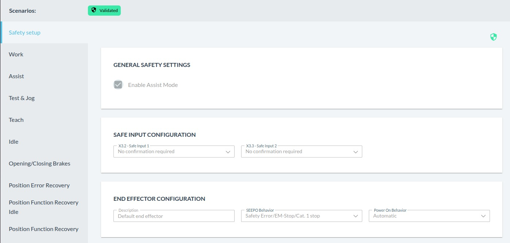
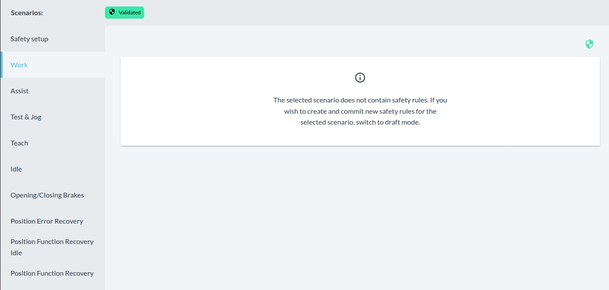
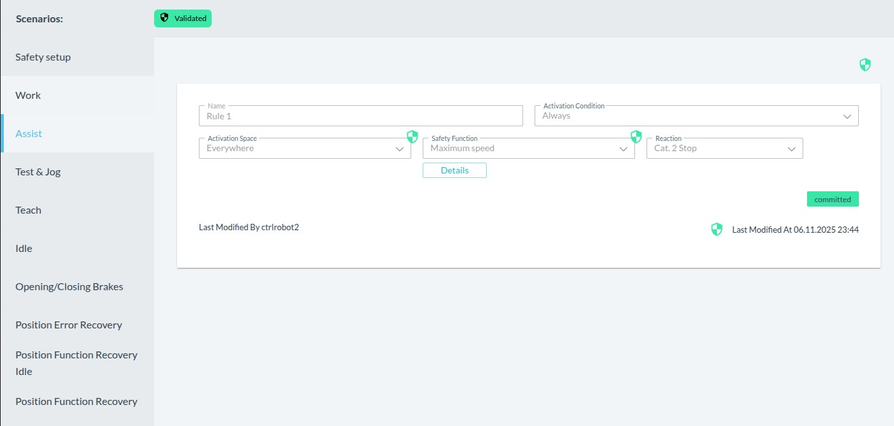
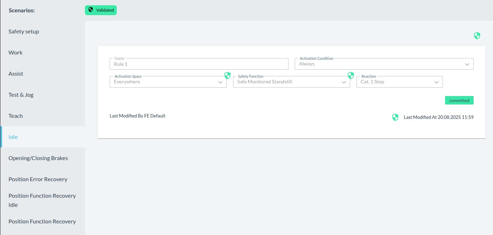
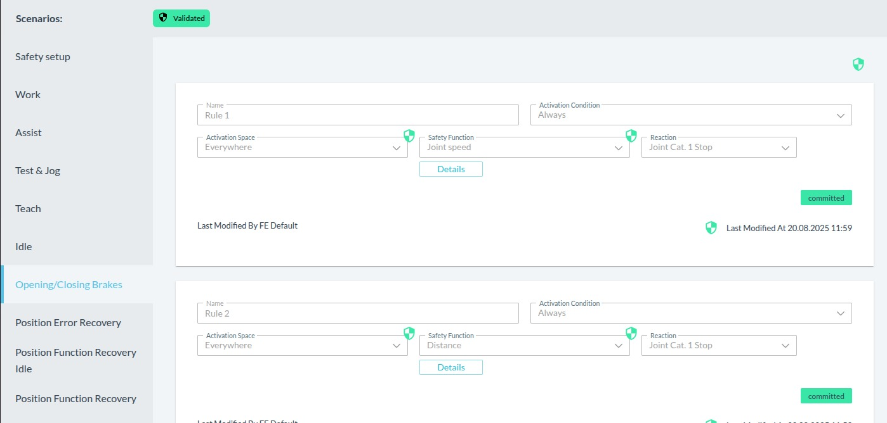

# Franka Setup

## FCI Setup

Credential values are intentionally omitted from this document. Store local credentials in `credentials.local.txt` and keep that file untracked. Use `credentials.example.txt` as the template.

### FR3 Robot 1

#### Accounts

| Role | User | Password | IP Address | Netmask | Hardware | libfranka |
| --- | --- | --- | --- | --- | --- | --- |
| Admin | `<admin_username>` | `<admin_password>` | `192.168.1.11` | `255.255.255.0` | `5.9.2` | `0.20.5` |
| Safety Operator | `<safety_operator_username>` | `<safety_operator_password>` | `192.168.1.11` | `255.255.255.0` | `5.9.2` | `0.20.5` |

#### FCI Communication

1. Activate FCI.
2. Check if you can reach the robot:

```bash
ping 192.168.1.11
```

### FR3 Robot 2

#### Accounts

| Role | User | Password | IP Address | Netmask | Hardware | libfranka |
| --- | --- | --- | --- | --- | --- | --- |
| Admin | `<admin_username>` | `<admin_password>` | `192.168.2.12` | `255.255.255.0` | `5.9.2` | `0.20.5` |
| Safety Operator | `<safety_operator_username>` | `<safety_operator_password>` | `192.168.2.12` | `255.255.255.0` | `5.9.2` | `0.20.5` |

#### FCI Communication

1. Activate FCI.
2. Check if you can reach the robot:

```bash
ping 192.168.2.12
```

### Common Setup

#### RT Kernel

1. Select `Advanced options for Ubuntu` during OS startup.
2. Username: `<root_username>`
3. Password: `<root_password>`
4. Select `rt*` for real-time communication between the console and FCI.

#### Open The Firewall And Allow The UDP Ports

1. Check which firewall service is present:

```bash
sudo systemctl status firewalld
sudo systemctl status ufw
```

2. Interpret the result:

| Result | Meaning | Action |
| --- | --- | --- |
| `firewalld` is `active (running)` | `firewalld` is managing firewall rules | Use the `firewall-cmd` commands below |
| `firewalld.service could not be found` and `ufw` is active | `firewalld` is not installed, `ufw` is managing firewall rules | Use the `ufw` commands below |
| Both services are inactive or not found | No host firewall service is currently enforcing rules | No firewall change is needed for FCI on this host |
| Both are active | Conflicting firewall managers may be installed | Disable one and keep a single firewall manager before changing rules |

3. Temporary setting:

```bash
sudo systemctl stop firewalld
sudo ufw disable
```

4. Permanent setting with `firewalld`:

```bash
sudo firewall-cmd --add-rich-rule='rule family="ipv4" source address="192.168.1.11/24" protocol value="udp" accept' --permanent
sudo firewall-cmd --add-rich-rule='rule family="ipv4" source address="192.168.2.12/24" protocol value="udp" accept' --permanent
```

5. Permanent setting with `ufw`:

```bash
sudo ufw allow from 192.168.1.11 proto udp
sudo ufw allow from 192.168.2.12 proto udp
```

### Set Up After Factory Resetting

1. Connect the Franka `X5` port to the computer.
2. Connect the Franka `C2` port to the LAN configured as DHCP. Ensure internet connectivity.
3. In the Franka portal, set `C2 – Shop Floor network settings` as a `DHCP` client.
4. Open `robot.franka.de`.
5. Follow the instructions on the web.
6. Complete the safety setup.

### Safety Setup

1. Log in as Safety Operator.
2. Go to the Watchman section.
3. Set it according to the screenshots.
4. Commit and submit the agreement.












## Conda Env Configuration
Minimal Conda setup for:
- `libfranka`
- `pylibfranka`
- `pinocchio`

### Files

- `environment.yml`
  Environment with pinned versions only for:
  - `python=3.10.19`
  - `cmake>=3.22,<4`
  - `eigen=3.4.0`
  - `libfranka=0.20.5`
  - `pinocchio=3.9.0`
  - `pylibfranka==0.20.5` via the `pip:` section
  Other supporting packages remain included without version pins.

- `install.sh`
  Creates or updates the `franka` Conda env from `environment.yml`.

### Recommended Install

From this repository root:

```bash
./install.sh
conda activate franka
```

To update an existing env in place:

```bash
./install.sh
```

Verify:

```bash
python - <<'PY'
import pinocchio
import pylibfranka
print("pinocchio", pinocchio.__version__)
print("pylibfranka", pylibfranka.__version__)
PY
```

### Build Configuration

Recommended `libfranka-test` configure/build from this repository root:

```bash
conda activate franka
cmak -S libfranka-test -B libfranka-test/cmake-build-release-franka \
  -DCMAKE_BUILD_TYPE=Release \
  -DFranka_DIR="$CONDA_PREFIX/lib/cmake/Franka"
cmake --build libfranka-test/cmake-build-release-franka
```

Direct run:

```bash
./libfranka-test/cmake-build-release-franka/test_libfranka 192.168.2.12
```

Equivalent one-shot build without activating the env:

```bash
conda run -n franka bash -lc '
  cmake -S "$PWD/libfranka-test" \
    -B /tmp/libfranka-test-build \
    -DCMAKE_BUILD_TYPE=Release \
    -DFranka_DIR="$CONDA_PREFIX/lib/cmake/Franka" &&
  cmake --build /tmp/libfranka-test-build
'
```

### Notes

- `libfranka` is installed from `conda-forge`; `pylibfranka` is installed by Conda via the `pip:` section.
- As of April 7, 2026, PyPI provides `pylibfranka 0.20.5` wheels for Python 3.10 on Linux.
- `conda` will install the `pip:` section after resolving the Conda packages in `environment.yml`.

### Realtime Scheduling

`libfranka` and `pylibfranka` may try to enable Linux realtime scheduling. If the OS denies that,
you can still connect with the fallback ignore mode in these tests, but for full realtime behavior
you need additional permissions.

Quick check with `sudo`:

```bash
sudo ./libfranka-test/cmake-build-release-franka/test_libfranka <robot_ip>
```

Recommended persistent setup for your Linux user:

Create `/etc/security/limits.d/franka.conf` with:

```conf
<your_username> soft rtprio 99
<your_username> hard rtprio 99
<your_username> soft memlock unlimited
<your_username> hard memlock unlimited
```

Then log out and log back in.

If you launch through `systemd`, also allow realtime there:

```ini
LimitRTPRIO=99
LimitMEMLOCK=infinity
```

Optional capability-based setup:

```bash
sudo setcap cap_sys_nice+ep ./libfranka-test/cmake-build-release-franka/test_libfranka
```

Check your current limits:

```bash
ulimit -r
ulimit -l
```

### Test Folders

- `libfranka-test/`
  Minimal CMake-based C++ smoke test for `libfranka`, with an optional live `readOnce()` check.

- `pylibfranka-test/`
  Minimal Python smoke test for `pylibfranka`, with an optional live `read_once()` check.
